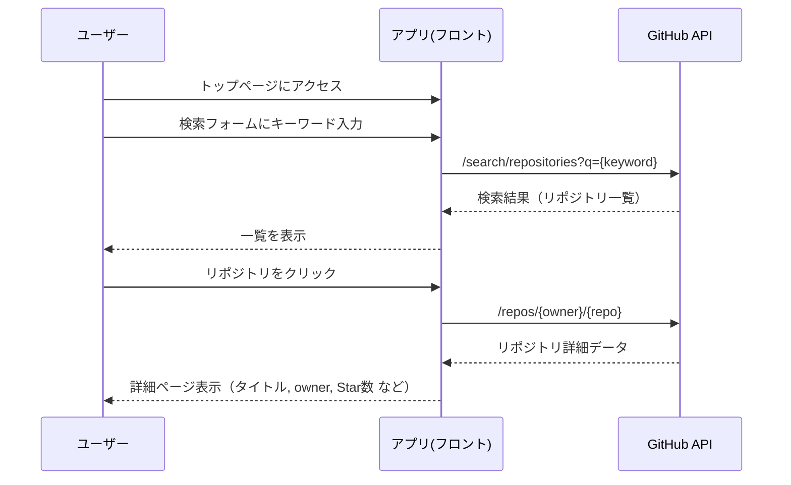

# RepoFinder

## 概要

GithubAPIを用いて、リポジトリの検索をすることができるアプリケーションを作成しました。

## 画面遷移フロー



## バージョン

| package   | version |
| --------- | ------- |
| node      | 22.18.0 |
| npm       | 11.5.2  |
| react     | 19.1.0  |
| next      | 15.5.0  |
| storybook | 9.1.3   |

## セットアップ

- リポジトリのクローン

```bash
$ git clone https://github.com/hiro0214/RepoFinder.git
```

- パッケージのインストール

```bash
$ npm ci
```

- ローカルサーバー起動

```bash
$ npm run dev
```

- アプリケーションビルド

```bash
$ npm run build
```

- storybook起動

```bash
$ npm run storybook
```

## リンク

より詳細な情報は下記にまとめました。

- [技術スタック詳細](./docs/DETAILS.md)
- [工夫した点](./docs/HIGHLIGHT.md)
